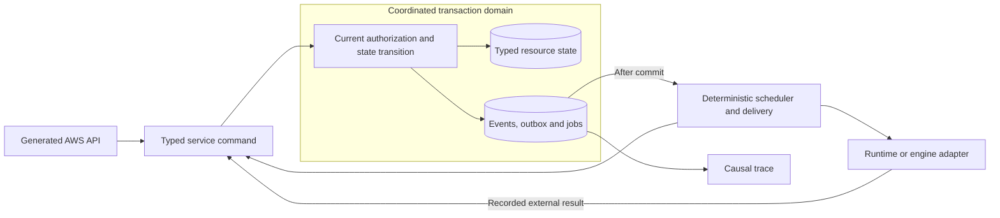

# Architecture decision: deterministic execution and real behavior

Accepted direction: explicit service selection, complete Smithy operation
inventory and real imported data planes. EC2 uses QEMU/KVM for firmware-booted HVM images behind service-owned
execution contracts; existing Lambda/ECS and engine containers remain unchanged. This is a
target architecture, not a claim that the kernel features below already exist.
[Architecture](architecture.md) describes the running implementation;
[TODO.md](../TODO.md) contains the delivery gates.
Shared clock injection and optional persistent manual time are implemented for
current built-ins. STS credential issuance and IAM access-key API mutations
commit typed events with resource state; see [the journal](event-journal.md).
Implemented service API completions feed history and configured trails;
the [producer inventory](cloudtrail.md#history-and-api-producers) records native evidence and gaps.
EventBridge retains SQS/Lambda/Logs delivery, Lambda retains asynchronous attempts,
and CloudTrail retains independent S3/Logs batches referencing the same journal.
Other producers, checkpoints, seeds and forks remain targets. These workers join the existing IAM/Organizations/SQS/KMS driver
and bounded drain. [Architecture](architecture.md) records current boundaries.

Keep the full emulator goal, Go implementation and inside-out completion order.
The operation-by-operation [inventory](services.json) includes every operation in
the pinned AWS SDK Smithy models for the explicitly [chosen services](service-targets.json),
alongside actual built-in health registrations. Registration marks an operation at
most `partial`, never complete. That inventory is not behavioral coverage:
generated unsupported dispatch adds no implemented resource behavior. Reuse
existing Go-native owners and extract shared mechanics only for demonstrated
production consumers; do not introduce a generic framework merely to increase
operation counts. CloudTrail Lake is excluded from the behavioral target, remains
model-known and returns honest unsupported errors. SMTP, hardware MFA and
specialty KMS remain deferred. Primary AWS contracts and native evidence define semantics.
Release gates measure behavior and complete application paths, not the number of
registered services. The September 13 direction prioritizes CloudTrail and
EventBridge kernels, then S3 delivery and Lambda execution, to exercise real
cross-service data paths. Initial service-depth gaps are explicitly allowed for
this push; unsupported behavior must remain visible and must never fake success.
Resolve the concrete IAM, storage and scheduling dependencies these paths expose.

Do not add fidelity labels or provenance headers to AWS responses. Evidence
belongs in executable tests, captured fixtures and CI reports. An operation
passing one differential scenario is evidence for that scenario, not a proof of
the operation's complete semantics.

The target path for a state-changing command is:

## Sources of behavior

| Source | Decision and boundary |
| --- | --- |
| Smithy models | Generate operations, shapes, constraints, protocol bindings, auth selection, modeled errors, pagination/waiter metadata and endpoint rules. Shared protocol engines implement signing, streaming and checksums against specifications and conformance vectors. Models cannot generate missing service semantics or opaque token algorithms. |
| CloudFormation registry | Pin regional schemas and generate property validation, identifiers, replacement constraints and handler permission requirements. Reuse available, licensed resource-provider handlers through controlled service endpoints. Schemas alone cannot create a working data plane, derive every ARN, or supply stack dependency, rollback and stabilization semantics. |
| Service implementations | Keep typed commands, state transitions and authorization for behavior owned by AWS. Extract deterministic transitions and explicit effects; avoid a generic resource CRUD engine. |
| Shared Go-native mechanics | Reuse typed storage, IAM, scheduling and events across concrete consumers. Generate only facts supplied by authoritative models, never substitutes for service semantics. |
| Existing engines | Run actual PostgreSQL, Valkey, Kafka-compatible brokers and OpenSearch behind service adapters where appropriate. Verify each engine/version against the supported AWS data-plane contract. PostgreSQL is not Aurora storage/failover; DuckDB is not an Athena compatibility guarantee. |
| Explicit external execution | Provide optional real-service, local-model and recorded-fixture adapters for behavior that needs them, including model inference. No automatic fallback to AWS, ambient credentials or network access. Replay must satisfy request, state and stream contracts; it does not complete an offline service. |

Smithy's [authentication traits](https://smithy.io/2.0/aws/aws-auth.html) select
authentication schemes; the cryptographic implementation still needs tests.
[Behavior traits](https://smithy.io/2.0/spec/behavior-traits.html) provide metadata
such as pagination and idempotency, not the service's state transitions.
CloudFormation publishes [regional resource schemas](https://docs.aws.amazon.com/AWSCloudFormation/latest/TemplateReference/resource-type-schemas.html)
and separate [handler contract tests](https://docs.aws.amazon.com/cloudformation-cli/latest/userguide/contract-tests.html).
Treat those as complementary inputs. Upstream model changes should produce a
reviewable generated diff and explicit unsupported operations, never fake success.

## Transactional state, event log and forks

Use one coordinated storage domain for the built-in resource state, scheduled
jobs, event journal and delivery records. Preserve typed service repositories and
service-owned SQLC tables in that domain. Do not replace them with untyped blobs
or expose a global mutable resource map.

A command reads an appropriate snapshot, validates current permissions and
preconditions, then atomically commits its resource transition and resulting
events/jobs. The append-only journal records versioned event types, command and
event IDs, scope, logical time, commit sequence and causal parent. Payloads use
typed schemas; credentials, raw identity tokens and private keys must not leak
into diagnostic events. State reconstruction requires a versioned snapshot plus
compatible events and recorded external results; an arbitrary audit log is not
sufficient for replay.

Events become deliverable only after commit. A durable outbox and consumer
checkpoints close the failure window between resource mutation and delivery.
Each delivery edge declares ordering, batching, retries, deduplication windows,
partial failure, visibility, acknowledgement, retention and dead-letter behavior.
The bus supplies these mechanics; a source-to-target adapter still owns the AWS
event shape, filtering and authorization. Avoid making an entire asynchronous
AWS workflow one database transaction: a source can succeed while a target fails.

Never hold a storage transaction while running customer code, calling an engine,
fetching OIDC keys or making an HTTP request. Commit an effect intent; execute it
outside the transaction; apply its result under version/idempotency checks. An
append-only journal cannot make an external side effect exactly once by itself.

A fork captures a consistent cut across resource tables, credentials, logical
clock, pending jobs, event positions, delivery attempts and deterministic ID
counters. Children isolate writes and preserve the parent. Restore must fence
old workers and stale callbacks so they cannot commit into the restored branch.
External engines need their own checkpoint/restart adapters; an in-flight process
or live AWS resource cannot be cloned by copying the local database.

The current `storage/memory.Domain` provides cancellable locking and atomic
clone-and-commit across related typed stores. Account, IAM/credentials,
Organizations, KMS, SQS, EventBridge, Lambda, S3, CloudTrail and Logs share a domain
through `Config.Storage`. The owning
repository callback supplies the context used by related readers and writers.
Ordinary nested writes stage together and abort with the owning transaction,
including KMS service-role provisioning. Explicit command attempts isolate a
recoverable child rejection, never an independent child commit; see the
[current transaction contract](sqlite-state.md#ownership-and-transactions).
SQS evaluates IAM/Organizations and queue policies
in its resource transaction. It prepares data keys outside its locks and
transactions, then repeats the command against current
authorization and queue state; see [the boundary](sqs-delivery.md#encryption-preparation-and-commit).
A separate journal adapter appends STS session, IAM access-key and Organizations
account-creation events within this domain. Provisioning acceptance and terminal
results retain their original request identity across recovery; journal failure
aborts the enclosing account/contact/IAM transaction.
The memory domain itself is not MVCC, persistence or a cross-service fork. The current services also have [SQLC-backed SQLite repositories](sqlite-state.md)
for typed identity, credentials, policy graphs, account provisioning, key material,
queue, event-bus/delivery, Lambda, S3, CloudTrail and Logs state in one native
transaction domain. Logs source rows, accepted-batch facts and subscription work
commit together; Lambda acceptance joins its own queue and fact, outside the Logs
transaction. Keep typed repositories and borrowed transactions when adding the
remaining services; do not replace them with an untyped resource store.

SQLite with service-owned SQLC schemas remains the first durable backend;
PostgreSQL must satisfy the same contracts. Neither SQLite nor a single database
automatically supplies cheap copy-on-write test forks. Select and benchmark a
snapshot/branch implementation against rollback, isolation, crash recovery and
fork-size targets before promising MVCC or a fork throughput number.

Shared API completions, service-origin metadata and the distinct CloudTrail,
EventBridge and CloudWatch consumers follow [the event contract](event-journal.md).
This contract is the authoritative producer boundary; do not add parallel
request loggers, per-service metric transport or a second event journal.

## Deterministic time and scheduling

The implemented time boundary is `Config.Clock`, shared by identity,
authorization and the IAM, STS, Organizations, KMS, SQS, CloudTrail, EventBridge,
Scheduler, Pipes, S3, Lambda and Logs providers. It defaults
to `clock.Real{}`. `clock.NewManual(start)` supplies a controlled UTC epoch;
`Now`, relative `NewTimer` and absolute `NewTimerAt` use that source. Absolute
registration avoids missing a deadline when time advances between a state
transition and timer creation. Timers support cancellation and reset, and stack
shutdown joins service waiters without closing the caller-owned clock. A clock
can be reused with retained backends or shared deliberately between stacks;
independent timelines require independent clocks.

`clock.OpenManual` stores a manual instant through `clock.Storage`; the SQLC
SQLite adapter commits each advance before publishing it or notifying timers.
The CLI restores that timeline before starting services. Local clock controls
and embedding calls share this path; see [time recovery](sqlite-state.md#manual-service-time).
Advances use their own native transaction and do not hold the timer mutex while
waiting for storage. They do not combine arbitrary resource transitions with the
clock commit, and timer registrations remain process-local.

KMS retains rotation schedules, accepted requests, regional lifecycle and import
deadlines in its typed repository. These records now drive the shared scheduler;
requests use the same transition functions when observing due state. Automatic
recovery and explicit drains apply rotation, readiness, expiry and deletion
without KMS API traffic. Each callback advances one key set through one deadline.
Lifecycle event publication and durable attempts remain open. See
[rotation behavior and evidence](kms-cryptography.md#symmetric-key-rotation).

`Manual.Advance(d)` only delivers notifications for currently registered due
timers. It rejects backward movement and does not drain service goroutines or
timers subsequently created by those goroutines. Equal-deadline notifications
follow registration order, which does not determine receiver execution order.
`Pending` and `WaitForTimers(ctx, n)` expose counts for test synchronization, not
job identity or completion. Tests must observe the relevant request/worker
result after advancing. Timer delivery never invokes service callbacks under
the clock lock.

`internal/scheduler` now serializes IAM credential/last-access reports,
service-linked deletion scheduling, Organizations account creation, handshake
deadlines, effective-policy publication, SQS redrive, KMS lifecycles, EventBridge
delivery, Scheduler occurrences/retries, Pipes source and target work, Lambda
asynchronous claims, CloudTrail delivery and Logs subscription work from their
typed repositories. Instance assembly joins their drivers before
startup, giving wakeups, explicit drains and shutdown one execution gate.
`Stack.RunDueJobs` and `POST /_stackd/jobs/drain` expose this group. A bounded drain
captures one clock instant, merges due times, and includes newly created work due
at that instant.
Equal deadlines use source registration order, then each source's stable key.
Sources revalidate selected work at their native commit boundary; report generations
fence stale workers and deletion jobs bind immutable role identities. Organizations
effective-policy publication uses the partition revision to discard stale
calculations and commits its published view, validation diagnostics and event
atomically, retaining the previous valid document on invalid inheritance. The driver
uses after-commit wake hints, absolute timers and periodic recovery, with
cancelable drains and joined shutdown. External service-linked usage checks run
as separately tracked, cancellable work; a drain schedules them without waiting
for their completion. Their completion order is external nondeterminism. Slow
checks do not hold the driver gate or prevent report generation. The driver
does not coordinate source transactions.

Account uses a separate instance of the scheduler for typed primary-email
delivery and completion jobs. SMTP runs outside the shared transaction;
completion publishes email ownership and status together. Generation checks
prevent stale delivery results from replacing newer requests. Retry deadlines
and OTP expiry use service time, while SMTP I/O uses cancelable real time.
These retained service records are not the cross-service event journal.

SQS redrive now uses the shared driver with typed due times, bounded draining,
retained cancellation and atomic message/counter progress. Shutdown preserves
accepted intents and reopening discovers them. Durable attempts,
cancellation/recurrence state and long-poll integration remain targets. The SDK
integration checks equal-deadline IAM, Organizations and SQS completion order
both live and after reopening retained memory or SQLite storage. These local
deadlines and their tie-break do not model AWS processing durations or telemetry
publication delays. Memory records survive reconstruction only while
their backend is retained. The SQLite SQS adapter now persists accepted tasks and
delivery progress across process exit. IAM/STS, Account, Organizations and KMS
state and optional manual time now persist in the same database. Scheduler
attempts and events for the remaining transitions remain necessary
before claiming durable deterministic recovery across the stack.

Logs subscriptions retain gzip payloads, source identities, filter incarnations,
retry/expiry and disable deadlines through memory reconstruction and SQLite reopen.
The scheduler invokes Lambda's real asynchronous acceptance outside source storage;
an acceptance/progress crash gap permits redelivery, not exactly-once effects.
Local work expires at 24 hours and retries exponentially from one second to five
minutes. Nonretryable errors disable exactly ten service-minutes and skip arrivals.
These are explicit local choices within documented AWS bounds, not measured native
deadlines. Immediate local filter activation does not model the stale configuration
observed before native settling. [Logs](logs.md#lambda-subscriptions) owns the
capture, real destination boundary, batching choices and remaining gaps.

Use this time for STS expiry, MFA age, resource lifecycles, visibility/retention,
retry schedules and, when implemented, TTL, Step Functions waits and EventBridge
scheduling. Saving clock/job state in snapshots and capturing deterministic IDs
and scheduling seeds remain planned. Keep security-sensitive keys and credentials
on real cryptographic entropy by default. Seeded resource IDs must remain unique
within their AWS scope and branch.

Separate service time from transport and host execution time. Unmodified SDKs
sign with wall-clock time, and network/context deadlines need a real cancellation
escape hatch. Gateway SigV4 skew, outbound HTTPS certificate validation and
HTTP/context deadlines retain wall time; a service-time advance does not
invalidate fresh SDK signatures. Modeled validity checks for
IAM-uploaded server certificates use service time.
Configure `NewHTTPOIDCDiscoveryWithClock` and `OAuthHTTPConfig.Clock` with the
instance source so cache/token lifetimes agree while network liveness remains
independent. Absolute external token times need a matching verifier epoch in
controlled tests.

Virtual time ends at the execution boundary. Do not claim to advance time inside
a customer's static Go binary, replace its system clock or make its threads
deterministic. A running workload completes in real time; the scheduler records
its result at the API/event boundary. Advancing across an unfinished execution
must wait for, cancel, or replay that explicitly identified effect according to
the selected test policy, never invent a successful result.

## IAM evaluation and strict behavior

Keep policy parsing/evaluation usable independently of the HTTP server and
storage implementation. Evolve the existing policy core and authorization
composition into a public Go library with explicit immutable input snapshots and
a structured decision trace. The trace identifies policy source/version,
statement, principal binding, matched and missing condition keys, explicit deny,
permission boundary, session restrictions, resource grants, SCP/RCP hierarchy
and dependent action decisions. Redact secrets without losing the explanation.

Enforcement and the AWS simulation API share evaluation primitives but retain
their separate contracts. The [AWS simulator has documented limitations](https://docs.aws.amazon.com/IAM/latest/UserGuide/access_policies_testing-policies.html);
simulator agreement alone cannot establish all live authorization behavior.
Use owned real requests for relevant resource, cross-account and organization
cases. Resource-owner RCPs now intersect built-in authorization and verified
STS federation; [the RCP guide](iam-resource-controls.md) records the captured
AWS cases and remaining conformance limits. The public [evaluation library](iam-evaluation.md) now owns the built-in
composition path and its per-permission trace. Traces joining dependent actions
and complete action/resource/condition conformance remain open.

Signature verification and authorization remain enabled by default. Modeled
anonymous operations are an explicit exception, with their real authentication:
STS web identity and SAML verify external tokens before issuing credentials.
Malformed signing material must never fall through to anonymous handling.

Keep normal behavior strict and reproducible. Offer seeded, per-service fault
profiles within verified AWS guarantees, including legal duplicate delivery,
propagation delays, throttling and exact retryable error/status combinations.
Do not equate stricter with arbitrary failure. S3 object GET/LIST after a
successful write is [strongly consistent](https://docs.aws.amazon.com/AmazonS3/latest/userguide/Welcome.html#ConsistencyModel);
deliberately stale object listings would test the wrong contract. Quotas need
versioned defaults plus account/region-specific overrides; the Service Quotas
catalogue is input, not a complete model of burst and retry behavior.

Quota/rate-limit completeness is lower priority than usable service behavior and
cross-service workflows. Implement common limits, correct scoped admission and
observable rejection/recovery where applications depend on them. Do not turn
exhaustive quota catalogues, fleet-allocation matching or expensive exhaustion
probes into a prerequisite for the next service. Keep omitted behavior explicit
in each service's current documentation and TODO inventory.

Reuse common service-time refill and charging mechanics when concrete callers
share their contract; keep quota selection, scope keys, transaction ownership,
retry scheduling and AWS error mapping with the service. Step Functions and
Kinesis control admission are candidates for a small shared token-bucket
primitive. DynamoDB's post-I/O capacity debt and Lambda's live concurrency
accounting have different contracts and must not be forced into that abstraction.
Extract with a current service change, not as a separate universal quota project;
this does not assume AWS's internal implementation.

## Borrow data planes and run real compute

This section is the target plan, with implemented Lambda and ECS task/service
execution described below; it is not a claim that every backend is available.
The core remains an embeddable Go binary: control-plane-only use requires no
external compute runtime. Lambda, ECS and imported engines retain explicit
per-instance container dependencies. EC2 uses QEMU/KVM for ordinary firmware
boot rather than requiring separate guest kernel/rootfs inputs or substituting
a Docker container. Missing or incompatible runtime support is an explicit
configuration error when execution is requested. There is no in-process handler
fallback or silent backend substitution.

Keep service-owned execution contracts, sharing infrastructure only where real
consumers have the same responsibility. The existing Docker connection is shared;
EC2 remains the authoritative AWS networking owner for workload attachments and
policy. Physical attachment, resource limits, observation and cleanup can be
shared as EC2 provides the next concrete consumer. Do not force guest boot/disk
lifecycle, ECS task coordination and Lambda Runtime API/warm environments into
one generic specification. No new Go abstraction is introduced by this plan.
Runtime adapters own actual processes/VMs and resource cleanup; services own AWS
state, errors and durable recovery. Pin upstream images, kernels and engines.
Sharing a backend never permits sharing another resource's data or credentials.

A resource becomes active only after its actual runtime or engine is ready, not
after a fixed timer or successful container creation. Startup, health, exit and
cancellation results drive its observable lifecycle, including failures. Provision
backend callback access to scoped credentials, Lambda runtime/extension APIs,
logs and the other stackd APIs the workload needs. Container-local `localhost`
is not the host API endpoint. Use explicit reachable endpoints and isolated DNS
per stack instance; customer SDK requests must reach the intended stack and
retain real authorization. Stream actual output and errors rather than fabricate
logs or successful invocations.

### Required backend map

The following map is authoritative for the planned data planes, not a support
matrix of today's built-ins:

| Service | Execution or engine target |
| --- | --- |
| Lambda | Official AWS base images from `public.ecr.aws/lambda/` for x86_64 and arm64, running the real Runtime Interface Client (RIC); compatible custom runtime images must honor the same Runtime API contract. |
| ECS | Real containers with Fargate as the default launch model; the AWS control plane owns task identity, placement, readiness and lifecycle. |
| EKS | Real Kubernetes through pinned k3d/k3s, with current IAM-bound tokens and native RBAC. An explicitly selected external kubeconfig remains a target; ambient `$HOME/.kube/config` never implies access or ownership. [EKS boundaries](eks.md) distinguish implemented owned-cluster behavior. |
| EC2 | QEMU/KVM boots HVM disks through configured BIOS/UEFI behind an instance-owned interface. Guest images must contain drivers for the presented hardware; this is not arbitrary AMI/Nitro equivalence. See [EC2 execution ownership](ec2.md#execution-and-shared-compute-ownership). |
| Batch, CodeBuild, Glue | Real job/build containers; CodeBuild includes pinned Amazon Linux build environments. |
| RDS / Aurora | Real version-mapped PostgreSQL, MySQL, MariaDB and SQL Server engines for their supported engine families. Aurora-compatible mappings must state their limits; they are not the proprietary Aurora engine. |
| DocumentDB / Neptune | Real version-mapped document and graph engines behind their AWS control planes. Explicit compatibility mappings and evidence are required; neither proprietary AWS engine is presumed available locally. |
| ElastiCache / MemoryDB | Real pinned Valkey/Redis engines selected by resource engine/version. |
| Amazon MQ | Real ActiveMQ at a pinned patch version. |
| MSK | Real pinned Apache Kafka. |
| OpenSearch / Elasticsearch | Real version-selectable engines with one shared domain registry across both AWS APIs, retaining each domain's state and engine lifecycle. |
| DynamoDB | Real DynamoDB Local data plane behind stackd's AWS control plane. |
| Kinesis | A real pinned Kinesis-compatible stream engine, with actual writes, reads and consumer behavior; control-plane records are not a stream implementation. |

Proprietary engine names do not establish native local availability. A mapping
must identify the runnable engine, upstream version, supported AWS behavior and
known differences; if no suitable backend is available, keep the operation
unsupported rather than substitute metadata-only success. An engine running
locally does not automatically reproduce its AWS managed-service control plane.

The implemented [ElastiCache/MemoryDB mapping](behavior-references.md#elasticache-and-memorydb-native-valkey)
is pinned Valkey 8.1.6, with explicit Redis 7.2 protocol compatibility. Native
TLS, ACLs, replication/slots, AOF and independent RDB snapshots are exercised
behind separate service-owned repositories and the shared job/clock domain.
This does not implement AWS-managed networking/storage, automatic failover or
MemoryDB's proprietary distributed durable log. Native default versions and
free-control fixtures are reported separately from the local engine's identity.

For Lambda, implement the [Runtime API](https://docs.aws.amazon.com/lambda/latest/dg/runtimes-api.html)
and extensions lifecycle around those real containers. Verify init/invoke/shutdown,
cold starts, warm reuse, configurable keepalive and forced cold starts, freeze/thaw, concurrency, timeout,
memory-to-CPU limits, read-only root filesystem, persistent warm-environment `/tmp`,
scoped credentials, logs, invocation errors and response streaming. Support local
code hot reload with explicit environment invalidation, not a direct handler call
or a claim that hot reload is an AWS API. Architecture support must be reported
honestly for each runtime host; do not relabel one architecture as the other.
AWS describes the [base image and filesystem contract](https://docs.aws.amazon.com/lambda/latest/dg/images-create.html).

The first [Lambda execution slice](lambda.md) now implements direct ZIP deployment,
real RIC readiness and invocation, current execution-role authorization, warm reuse,
timeout reset and code/configuration invalidation on memory and SQLC SQLite.
It also implements function policy enforcement, retained asynchronous attempts and
EventBridge/Logs acceptance, with delayed Lambda queue-configuration application
in service time. Logs subscription configuration is separate and activates
immediately locally. The linked behavior guides own current evidence and
limitations; remaining runtime protocols, data planes and networking requirements
above remain targets.

The [ECS runtime](ecs.md) now executes standalone Linux Fargate containers and
replica services with typed memory/SQLite tasks, deployments and exact-request
tokens, dependency/health observations, reverse shutdown, EC2-managed ENIs and native SG/NACL enforcement.
Task-role metadata credentials use current IAM authorization; actual output
reaches CloudWatch Logs, and task state/EventBridge admissions commit together.
SQLite process restart reattaches native customer processes rather than replacing
them. The shared CLI Docker configuration constructs both executors and uses
`Config.ComputeEndpoint`/`-compute-endpoint`; ECS requires local rootful Linux
Docker, systemd/cgroup v2 and its preinstalled pinned toolkit image.
The linked guide owns bounded CLI/SDK evidence and explicit gaps: unsupported
service dependencies and EC2-backed ECS placement, disk quotas, blocking awslogs
backpressure, credential-vending source context and broader VPC networking remain incomplete.
Fargate is a deliberate local default, not AWS's empty-strategy default.
Its typed counter interface observes real CPU time and working-set memory outside
transactions. ECS retains accepted service-time metric windows and publishes them
through CloudWatch atomically; it does not synthesize CPU usage from clock advances
or replay counters across process restart. See [service metrics](ecs.md#service-metrics).

Determinism remains at the API/event edge: record execution outcomes and their
causes in service time, while customer code and engines run in real time.
Advancing the emulator clock cannot make their threads, system clocks or external
effects deterministic.

## Networking, tracing and evidence

Model VPC reachability, security groups, NACLs, routes, DNS, endpoints and endpoint
policies as explicit inputs to connectivity decisions. Use a reachability graph
for explainable policy decisions and actual network isolation/enforcement at
compute edges. netns/eBPF are possible Linux mechanisms, not portable core
requirements. Test stateful security groups, stateless NACLs and endpoint policy
authorization separately; merely predicting reachability does not enforce it.

Keep endpoint overrides and the in-process control-plane embedding API supported.
Runtime DNS must resolve instance-local service/resource names inside isolated
container networks. Optional host-facing DNS/local-CA integration belongs in an
isolated test environment; never replace host DNS or trust roots automatically.
Enforce modeled connectivity on actual backend and callback traffic, not only
in a reachability explanation. Full tracing through API, outbox, delivery and
execution spans, including optional OpenTelemetry export, remains a target.
Current causal attribution is narrower: `apievents.Reserve` creates fresh API
outcome identities, and the gateway adds a runtime parent only after verifying
the SDK request's signature. Active Lambda invocation attribution remains dynamic.
Lambda's synchronous execution uses its reserved outcome ID; asynchronous
execution uses its retained accepted invocation ID. The runtime wrapper clears its
public-key mapping after invocation, with a
separate origin lock and cancellation/shutdown checks. No SDK changes, response
headers or authorization grants are involved. This supports the committed
Logs batch → Lambda acceptance → signed SQS acceptance chain, not
initialization/idle SDK causality or native X-Ray. Trace diagnostics remain
separate from AWS response labels; [the journal contract](event-journal.md) owns
these interfaces and [Logs evidence](logs.md#native-subscription-evidence) owns
the 380-request native capture and its bounded observations.

ECS task-role credentials instead retain the issuing task-command event in their
typed IAM record. Authenticated SDK calls preserve that parent with cached
credentials across controller restart, including cross-region calls and current
IAM denials. This metadata supplies no authorization and requires no separate
credential lookup or task registry. See [task execution evidence](ecs.md).

Pin SDK, Terraform, CDK and CFN suites and run the applicable scenarios against
explicit local endpoints. Review their licenses, prerequisites and live-account
effects. They provide valuable cases, not a free complete conformance corpus.
Capture owned AWS scenarios with operation sequence, permissions, scope,
normalized identifier relationships, semantic times, errors and cleanup. A diff
must not normalize away expiry, ordering, missing fields or authorization failures.
Live runs need a bounded resource/cost plan and verified cleanup; offline CI never
silently falls back to them. CI reports exact tested cases and outstanding gaps.

Startup, memory, fork throughput and replay latency become measured release
budgets. Static Go control-plane packaging and in-process embedding come first;
a Wasm build is a later control-plane experiment with explicit filesystem/network
limitations. It does not package container runtimes, QEMU/KVM, Kubernetes
or native database engines; data planes remain explicit external dependencies.

## X-Ray storage and audit

The generated X-Ray REST JSON frontend executes segment ingestion/retrieval and
resource policies, trace summaries and trace/service graphs, group lifecycle and
shared tags, sampling-rule controls, target allocation, statistic summaries and
daemon telemetry admission.
Unimplemented generated operations return protocol errors. Insights-enabled
groups, forecast statistics, remaining account controls and CloudWatch Transaction
Search are not implemented; registrations do not establish complete X-Ray parity.
`docs/services.json` records pinned SDK model provenance and registrations.
Captured AWS traces join ordinary segments and nested subsegments under one trace identity.

`internal/services/xray` owns commands and consumer-defined storage; memory and
SQLC SQLite implementations retain partition/account/region scope. A submitted
document is validated before any of its inline segments are written. Mixed calls
retain accepted documents and return native per-document rejection classes.
Inline and independent subsegments share a trace/segment key. In-progress state
can complete; the first completed version wins, including when its parent later
completes. Completed-parent retries cannot replace its submitted tree.
Ordinary segments with `parent_id` remain separate entries; independent
subsegments fold into their parent. Orphan-only traces retain an empty segment
list and null duration until a parent arrives. Duration spans attached positive
start times and valid completed ends, including child ends beyond a parent;
unattached subsegments do not extend it.
Native retrieval also materializes inferred receivers when a completed remote or
AWS subsegment has no reported callee. Real reported segments replace that
inference; customer exception details remain on their originating subsegment.
AWS resource identity uses the same operation/resource metadata as graph
projection, including server-owned `resource_names` and SQS `QueueTime`.
Opaque inferred IDs are stable locally across reads and restoration.

Trace discovery distinguishes trace-start, latest accepted-event and service
span clocks. Filters share decoded topology, typed annotations, service/edge
predicates and causal paths rather than reparsing documents for each predicate.
Native equal-priority causal branches do not specify one stable tie order; local
traversal is deterministic and selects a valid productive path, not every branch.
Continuation is scoped to the query and owner. Query sampling uses stable local
selection; native unpublished index page sizes and propagation delays are not
invented configuration knobs.

Groups retain first matching ingestion membership and its filter version.
Updating a filter does not rewrite historical membership. Deleted group
incarnations stop resolving, including graph requests using the old ARN.
Default and custom group matches earn one `AWS/X-Ray` `ApproximateTraceCount`
sample per trace/group membership. The scheduler publishes closed-minute sums
with `GroupName` and unit `None`; duplicate documents do not add matches.
Deleting a group does not erase its pending earned count. Native distributed
zero-sample/sub-minute publication cadence is not reproduced.

Sampling rules and their tags share one regional authority, including Default.
Client reports feed closed ten-second windows, bounded reservoir leases and
statistic summaries; duplicate client/window reports do not spend the reservoir
twice. Outstanding leases remain reserved when other clients report.
Boost targets consume closed service-anomaly windows and obey the rule's maximum
rate and cooldown. Source-owned `SamplingRate` metrics use `RuleName`, not
synthetic customer metric calls. Native cold-cache visibility does not define
an exact delay. The captured zero-cooldown server error conflicts with the
published nonnegative model; local zero means no cooldown.

Graph history uses accepted trace revisions, not wall-clock guesses. A streamed
root completing from a prior owned envelope of `3.5` to response `7` yields native
trace duration `10.5`; a subsequently accepted non-extending child resets the
trace duration to `7`, while service statistics retain both observations.
Initially completed roots instead retain one service observation as later
children extend its envelope. Already completed document replacements remain
ignored. Reported descendants own their own service spans; they do not extend
the caller's envelope. Completed subsegments remain retrievable while their
reported service is in progress, but do not publish its service statistics yet.
Receiver counts, empty service histograms and populated edge histograms are
distinct native outcomes, not missing data filled with synthetic samples.

`duration_edges.json` supplies ordered partial growth, completion, accepted new
children and ignored completed retries, including a retained-trace continuation.
Arbitrary older in-progress document versions are not stored. Native evidence
discriminates one later streamed update; further repeated updates follow the same
reconstruction but are not independently established AWS behavior. The cold
group's lost initial completed-root contribution is excluded narrowly from
grouped comparison; converged ungrouped and per-trace projections remain asserted.
Immediate stale native query/group indexes are not empty-result oracles.

The shared IAM evaluator enforces current caller policies, session restrictions
and resource-policy denies. Captured role grants did not replace missing identity
permission. Policy writes bind existing principals, enforce the five-policy and
5-KB limits, protect against caller lockout unless explicitly bypassed, and use
native revision compare-and-swap. Identical successful writes advance revisions;
stale writes leave state unchanged. Bound-principal rendering uses the existing
IAM authority, not a parallel principal registry.

Trace retention uses thirty days from receipt, not the timestamp-looking part of
a trace ID. This admits captured W3C IDs and old/future document timestamps.
The common service clock and scheduler expire reads and physically remove
records; completed retries do not extend their original receipt lifetime.
Policy/segment transitions and their accepted API events share the repository
transaction. Policy controls are management events; ingestion/retrieval are
`AWS::XRay::Trace` data events with no invented resource ARN. Ingestion audit
`traceSegmentDocuments` contains only accepted bare trace IDs, not document
bodies or rejected IDs. Existing trail selectors and EventBridge consumers own
subsequent delivery.
Trace summaries, graphs and sampling targets use native data-event classification;
sampling/group/tag controls and sampling statistic summaries use management
classification. Sampling audit
timestamps use native UTC rendering and omitted successful counters materialize
as zero. Group deletion records its resolved ARN even though its wire response
is empty. Duplicate tag keys reject without mutation using the captured internal
failure class and null audit request. Read-only management delivery requires an
EventBridge rule enabled for all CloudTrail management events.

`testdata/aws/xray/segments_and_policies.json` retains native controls, errors,
raw responses, request-correlated CloudTrail records and assembly/duration
captures. SDK replay exercises both stores. Classic-destination positive traces
come from us-west-2; the captured us-east-1 CloudWatchLogs destination is not an
empty-trace oracle. Local ingestion is immediately readable; native convergence
polls do not establish a fixed visibility delay. An actual SQLite executable
restart preserved trace assembly and policy revisions, rejected unauthorized
ingestion and stale revisions, and delivered ten identical X-Ray events through
CloudTrail S3 logs and EventBridge/SQS. Service-time advancement verified presence
one second before thirty days, absence at the boundary and zero retained rows.
Owned native policies, roles, trails and buckets were removed; trace documents
have no deletion API and remain subject to native retention.

Consumer evidence is retained in `sampling.json`, `sampling_edges.json`,
`trace_queries.json`, `query_time_edges.json`, `group_edges.json`,
`trace_projection_edges.json`, `trace_aggregate_edges.json`,
`histogram_edges.json`, `cause_branch_edges.json`, `duration_edges.json` and
`inferred_documents.json` under `testdata/aws/xray`. Local transition fixtures
exercise expiry, deletion, query isolation and pending-metric recovery. Native
histograms use t-digest with variable bins, not a fixed sixty/one-hundred-bin
contract. Local sorted t-digest is deterministic; the private compression bound
is not an AWS limit. Replays compare conserved count, weighted moments and
meaningful distribution boundaries where native merge bins vary.

An actual SQLite executable restart preserved query windows, group tags,
sampling state, inferred documents, history-sensitive graphs and pending
publication. It allocated a five-slot reservoir, returned boosted targets,
rejected an unauthorized graph read and a deleted group, and published group
sums `2/2/1`, including the deleted group's pending count. All 27 selected X-Ray
events arrived with identical payloads in S3 and EventBridge/SQS when the rule
included read-only management events.

`GetTimeSeriesServiceStatistics` uses the existing retained trace/group owners
and completion observations, not a second statistics store. Native
`time_series_west.json` and `time_series_settled.json` establish receipt-time
minute endpoints selected in `[StartTime, EndTime)`, whole-second request bounds,
60/300-second periods, newest-first order, root-edge defaults, service/edge
selectors and distinct latency histograms. Five-minute aggregation merges the
selected minute buckets. Nonmatching selectors preserve observed bucket
timestamps without inventing zero statistics. Named-group selector reads retain
the captured old-group-version flag. The early west capture indexed only its
first batch; replay separates that state from the settled two-batch capture
rather than encoding native indexing delay.

The east `time_series.json` and `time_series_receipt.json` captures establish
validation only, not positive classic-trace behavior. Both owned native groups
were deleted and independently confirmed absent; their synthetic traces remain
under AWS retention. No destination, indexing, sampling or encryption setting
was changed.

Signed Go SDK fixtures replay on memory and reopened SQLite. The
[executable workflow](../testdata/integration/xray_time_series.json) verifies
actual bucket values, current IAM grant/revocation, region isolation, retained
group membership, and 1,001 ordered buckets across a pagination-token restart.
All three controllers exited zero; owned local groups and reader were removed.
The 1,000-point page boundary is local, not a claim about AWS index pages.
Tokens bind the request, account/region/partition and group incarnation.
Forecast requests fail explicitly until an Insights-backed forecast owner exists.
The [API reference](https://docs.aws.amazon.com/xray/latest/api/API_GetTimeSeriesServiceStatistics.html)
defines the modeled contract; [CloudTrail documentation](https://docs.aws.amazon.com/xray/latest/devguide/xray-api-cloudtrail.html)
classifies the operation as a read-only `AWS::XRay::Trace` data event. This does
not establish native forecasting, pagination sizes, indexing latency or full
X-Ray conformance.

`PutTelemetryRecords` admits real daemon health reports under
`xray:PutTelemetryRecords` and commits their API observation through the existing
repository transaction. There is no documented public health-counter retrieval,
customer CloudWatch mapping or telemetry retention contract to emulate, so this
does not create a second repository, metric family or read API.
`telemetry.json` retains 31 native admission cases, ordered IAM allow/session-deny
calls and 21 request-correlated telemetry data events. Omitted counters remain
absent, explicit zero and empty backend-error objects remain present, fractional
integers truncate and overflow saturates to int32 through the existing generated
native correction. An empty record list rejects; batches of 11 and 30 succeed.
The daemon's ten-record send batch is not an API limit.

JSON document timestamps obey generated timestamp-format metadata and the
protocol's numeric default; canonical Query/XML/header values remain separate.
Native string timestamps reject as serialization failures. Telemetry audit
timestamps use whole-second UTC strings and `responseElements` is null.
A null record produces the captured HTTP 500 class and an `UnknownError` audit
with its null list element retained. The first native trail window missed both
telemetry and positive controls; the repeated capture waited for correlated
management delivery before probing. Missing validation/serialization events in
the bounded window do not establish nonlogging.

The official `public.ecr.aws/xray/aws-xray-daemon:3.7.0` image, digest
`sha256:b67576293f4d3a0a155f807244957ed0aa4bc945df1573d62d81380a1d548071`,
ran against the actual SQLite executable using local IAM credentials and its
configured endpoint. Its TCP sampling proxy returned rules/targets, a UDP segment
became retrievable, and SIGTERM flushed a real report with one received and one
sent segment. Configured CloudTrail S3 and EventBridge/SQS consumers received the
same telemetry event; the trace and delivered log survived executable restart.
The daemon's implementation contract is pinned to source
`c742f4f0248513bdb6f54f1ccb8db809a8939a9e`; its wall-clock health reporting is not
the emulator's deterministic service scheduler.

Step Functions is an actual producer through these same sampling and ingestion
commands, not a privileged trace-store writer. Its retained history owns
workflow/state/container spans; the task command boundary owns API spans.
The existing X-Ray assembler owns inferred SQS receivers and orphan envelopes.
[Step Functions tracing evidence and boundaries](stepfunctions.md) records native
document comparisons, execution-role enforcement and restart verification.

Primary contracts:
[segment documents](https://docs.aws.amazon.com/xray/latest/devguide/xray-api-segmentdocuments.html),
[resource policies](https://docs.aws.amazon.com/xray/latest/api/API_PutResourcePolicy.html),
[filter expressions](https://docs.aws.amazon.com/xray/latest/devguide/xray-console-filters.html),
[sampling targets](https://docs.aws.amazon.com/xray/latest/api/API_GetSamplingTargets.html),
[service graphs](https://docs.aws.amazon.com/xray/latest/api/API_GetServiceGraph.html),
[daemon telemetry](https://docs.aws.amazon.com/xray/latest/api/API_PutTelemetryRecords.html),
[REST JSON timestamps](https://smithy.io/2.0/aws/protocols/aws-restjson1-protocol.html#json-shape-serialization),
[histogram approximation](https://aws.amazon.com/blogs/aws/latency-distribution-graph-in-aws-x-ray/),
[CloudTrail](https://docs.aws.amazon.com/xray/latest/devguide/xray-api-cloudtrail.html)
and [retention](https://docs.aws.amazon.com/xray/latest/devguide/xray-concepts.html).
[SNS propagation](sns.md#x-ray-propagation) records the separate Active-tracing
blocker. No sampled service spans or response labels are fabricated.
